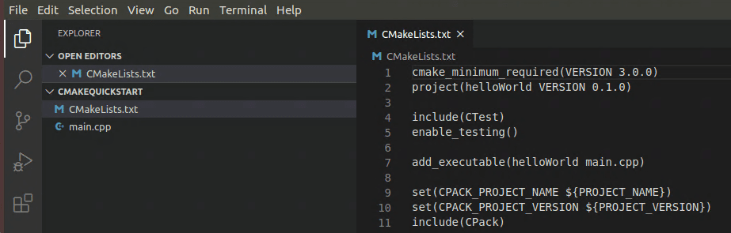
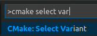

This section will step by step guide to the process of setting up a C++ development environment on a Debian/Ubuntu based distribution.

- [Setting up development environment](#setting-up-development-environment)
  - [Updating system packages](#updating-system-packages)
- [Install the build-essential package](#install-the-build-essential-package)
- [Install CMake](#install-cmake)
- [Git](#git)
  - [Install Git](#install-git)
- [IDEs](#ides)
  - [Code::Blocks](#codeblocks)
    - [Install using the APT package manager](#install-using-the-apt-package-manager)
    - [Install using Flatpak](#install-using-flatpak)
- [Text Editors](#text-editors)
  - [Install Visual Studio Code](#install-visual-studio-code)
    - [Install helper extensions](#install-helper-extensions)
    - [Create a CMake project](#create-a-cmake-project)
      - [Create a CMake hello world project](#create-a-cmake-hello-world-project)
      - [Select a kit](#select-a-kit)
    - [Configure Hello World](#configure-hello-world)
      - [Select a variant](#select-a-variant)
      - [CMake: Configure](#cmake-configure)
    - [Build Hello World](#build-hello-world)
- [Using libraries](#using-libraries)
  - [vcpkg](#vcpkg)
    - [Install vcpkg](#install-vcpkg)
    - [Install libraries for your project](#install-libraries-for-your-project)
    - [Using vcpkg with CMake](#using-vcpkg-with-cmake)
- [Unit testing](#unit-testing)
  - [Google Test (GTest)](#google-test-gtest)
- [Addtional Tooling](#addtional-tooling)
  - [ClangFormat](#clangformat)
    - [Installing Clang-format](#installing-clang-format)
    - [Configuring Clang-format](#configuring-clang-format)
    - [Using Clang-format with VSCode](#using-clang-format-with-vscode)
  - [C/C++ include guard (proud contributor)](#cc-include-guard-proud-contributor)
  - [include-info (proud maker)](#include-info-proud-maker)

<a name="setting-up-development-environment"></a>

### Setting up development environment

<a name="updating-system-packages"></a>

#### Updating system packages

Open a terminal and type the following commands

```
sudo apt upate
sudo apt upgrade -y
```


<a name="install-the-build-essential-package"></a>

### Install the build-essential package

The build-essentials packages are the form of meta-packages that are essential to compile software. They contain the GNU/g++ compiler collection, GNU debugger, and a few more libraries and tools that are needed for compiling a program. A few other packages, like GCC, make, G++, dpkg-dev, etc., are also installed on our system when we install the build-essential packages.
This meta-package contains five different packages that are important to compile software on Debian/Ubuntu.

- **g++**: It is a GNU compiler for C++ language.
- **gcc**: It is a GNU compiler for C language.
- **make**: It is a helpful utility that is used to direct the program's compilation. The tool, i.e., make, interprets a file known as "makefile" that can guide the compiler on how to operate.
- **libc6-dev**: It is a GNU C library. It includes the header files and development directories used for compiling general C++ and C scripts.
- **dpkg-dev**: This package is used to upload, build, and unpack Debian source packages. It is helpful if we wish to package our application for a Debian-based system.

To install the build-essential package type the following command

```
sudo apt install build-essential -y
```


<a name="install-cmake"></a>

### Install CMake

CMake is an open-source, cross-platform tool that uses compiler and platform independent configuration files to generate native build tool files specific to your compiler and platform.
To install CMake type the following command

```
sudo apt install cmake -y
```


<a name="git"></a>

### Git

<a href="https://git-scm.com/" target="_blank">Git</a> is a free and open source distributed version control system designed to handle everything from small to very large projects with speed and efficiency.

<a nme="install-git">

#### Install Git

The easiest way to install Git on a Debian/Ubuntu based system is to use its native package manager APT.

```
apt install git
```

<a name="ides"></a>

### IDEs

Linux provides a wealth of options for C++ Integrated Development Environments (IDEs), allowing you to choose the tool that best suits your needs. Popular choices include Code::Blocks, Eclipse, and CLion.
In the following we'll explore the process of setting up **Code::Blocs**

<a name="code-blocs"></a>

#### Code::Blocks

Code::Blocks is a free C/C++ and Fortran IDE built to meet the most demanding needs of its users. It is designed to be very extensible and fully configurable.

##### Install using the APT package manager

The best way to install CodeBlocks on a Debian/Ubuntu based system is to use its native package manager APT.

```
sudo apt install codeblocks
```


To have more features through this IDE you can install some additional plugins available through the packages called codeblocks-contrib.

```
sudo apt install codeblocks-contrib
```


##### Install using Flatpak

If the above-given method is not working for you then use the Flatpak. It is a universal package manager that we can use to easily install using the default system repository of Ubuntu 22.04 or 20.04.

```
sudo apt install flatpak
```

After installing the Flatpak, add its FlatHub repository as well.

```
sudo flatpak remote-add --if-not-exists flathub https://flathub.org/repo/flathub.flatpakrepo
```

Once you have added the repo, restart your PC to integrate the Flatpak properly into the system.

```
sudo reboot
```

Now, run the given command to install the Code::block IDE on the system.

```
flatpak install flathub org.codeblocks.codeblocks
```


Run Code::Block

```
codeblocks &
```


<a name="text-editors"></a>

### Text Editors

There is a wealth of choices in text editors for C++ develpment that support advanced features such as code completion and name refactoring. To name just a few, we have:

- Atom
- Visual Studio Code
- Subime Text
- Vim

<a name="install-visual-studio-code"></a>

#### Install Visual Studio Code

Visual Studio Code is probably one of the best choices for beginners today. It has a nice UI, offers some basic IDE features like completion and jumping to definitions

The easiest way to install Visual Studio Code for Debian/Ubuntu based distributions is to download and install the <a href="https://go.microsoft.com/fwlink/?LinkID=760868" class="external-link" target="_blank">.deb package (64-bit)</a>, either through the graphical software center if it's available, or through the command line with:

```
sudo apt install ./<file>.deb
```

Visual Studio Code is also officially distributed as a Snap package in the Snap Store and you can install it by running

```
sudo snap install --classic code
```

Using Fatpak is another way to install Visual Studio Code

```
flatpak install flathub com.visualstudio.code
```

<a name="install-helper-extensions"></a>

##### Install helper extensions

Install `Microsoft C/C++` extension, It is a Language Server by Microsoft.
     

Install two extensions for cmake. The first one (from twxs) in the list is for syntax highlighting when writing cmake scirpts. The second one (from Microsoft) in the list is for actually running Cmake.
     

<a name="create-a-cmake-project"></a>

##### Create a CMake project

Create a folder for a new project. From the Terminal window, create an empty folder called cmakeQuickStart, navigate into it, and open VS Code in that folder by entering the following commands:

   ```
   mkdir cmakeQuickStart
   cd cmakeQuickStart
   code .
   ```

   The `code .` command opens VS Code in the current working folder, which becomes your "workspace".

<a name="create-a-cmake-hello-world-project"></a>

###### Create a CMake hello world project

The CMake Tools extension can create the files for a basic CMake project for you. Open the Command Palette (`Ctrl+Shift+P`) and run the CMake: Quick Start command:


Enter a project name. This will be written to `CMakeLists.txt` and a few initial source files.

Next, select **Executable** as the project type to create a basic source file (`main.cpp`) that includes a basic `main()` function.


>**_NOTE_** If you had wanted to create a basic source and header file, you would have selected **Library** instead. But for this tutorial, **Executable** will do. If you are prompted to configure IntelliSense for the folder, select **Allow**.

This creates a hello world CMake project containing `main.cpp`, `CMakeLists.txt` (which tells the CMake tools how to build your project), and a folder named `build` for your build files:



<a name="select-a-kit"></a>

###### Select a kit

Before you can use the CMake Tools extension to build a project, you need to configure it to know about the compilers on your system. Do that by scanning for 'kits'. A kit represents a toolchain, which is the compiler, linker, and other tools used to build your project. To scan for kits:

1. Open the Command Palette (`Ctrl+Shift+P`) and run CMake: Select a Kit. The extension will automatically scan for kits on your computer and create a list of compilers found on your system.
2. Select the compiler you want to use. For example, depending on the compilers you have installed, you might see something like:


<a name="configure-hello-world"></a>

##### Configure Hello World

There are two things you must do to configure your CMake project: select a kit (which you just did) and select a variant.

The kit you selected previously is shown in the Status bar. For example:


To change the kit, you can click on the kit in the Status bar, or run the **CMake: Select a kit** command again from the Command Palette. If you don't see the compiler you're looking for, you can edit the `cmake-tools-kits.json` file in your project. To edit the file, open the Command Palette (`Ctrl+Shift+P`) and run the **CMake: Edit User-Local CMake Kits** command.

<a name="select-a-variant"></a>

###### Select a variant

A variant contains instructions for how to build your project. By default, the CMake Tools extension provides four variants, each corresponding to a default build type: `Debug`, `Release`, `MinRelSize`, and `RelWithDebInfo`. These options do the following:

`Debug`: disables optimizations and includes debug info.
`Release` : Includes optimizations but no debug info.
`MinRelSize` : Optimizes for size. No debug info.
`RelWithDebInfo` : Optimizes for speed and includes debug info.

To select a variant, open the Command Palette (`Ctrl+Shift+P`) run the CMake: Select Variant command.


Select **Debug** to include debug information with your build.

The selected variant will appear in the Status bar next to the active kit.

<a name="cmake-configure"></a>

###### CMake: Configure

Now that you've selected a kit and a variant, open the Command Palette (`Ctrl+Shift+P`) and run the **CMake: Configure** command to configure your project. This generates build files in the project's build folder using the kit and variant you selected.

<a name="build-hello-world"></A>

##### Build Hello World

To run and debug your project, open `main.cpp` and put a breakpoint on the `std::cout` line. Then open the Command Palette (`Ctrl+Shift+P`) and run **CMake: Debug**. The debugger will stop on the `std::cout` line:

Go ahead and press `F5` to continue.

<a name="using-libraries"></a>

### Using libraries

<a name="vcpkg"></a>

#### vcpkg

vcpkg is a free C/C++ package manager for acquiring and managing libraries. It allows us to choose from over 1500 open source libraries to download and build in a single step or add our own private libraries to simplify the build process. Maintained by the Microsoft C++ team and open source contributors.

<a name="install-vcpkg"></a>

##### Install vcpkg

Installing vcpkg is a two-step process:
first, clone the repo,

```
git clone https://github.com/Microsoft/vcpkg.git
```

then run the bootstrapping script to produce the vcpkg binary.

```
./vcpkg/bootstrap-vcpkg.sh
```

<a name="install-libraries-for-your-project"></a>

##### Install libraries for your project

```
vcpkg install [packages to install]
```

<a name="using-vcpkg-with-cmake"></a>

##### Using vcpkg with CMake

In order to use vcpkg with CMake outside of an IDE, you can use the toolchain file:

```
 cmake -B [build directory] -S . -DCMAKE_TOOLCHAIN_FILE=[path to vcpkg]/scripts/buildsystems/vcpkg.cmake 
```

Then build with:

```
cmake --build [build directory]
```

With CMake, you will need to find_package() to reference the libraries in your `Cmakelists.txt` files.

<a name="unit-testing"></a>

### Unit testing

<a name="google-test-gtest"></a>

#### Google Test (GTest)

Google test is a framework for writing C++ unit tests. In the following, I explain how to set it up.
Start by installing the gtest development package

```
sudo apt install libgtest-dev
```

Note that this package only install source files. You have to compile the code yourself to create the necessary library files. These source files should be located at /usr/src/gtest. Browse to this folder and use cmake to compile the library

```
cd /usr/src/gtest
sudo cmake CMakeLists.txt
sudo make
 
# copy or symlink libgtest.a and libgtest_main.a to your /usr/lib folder
sudo cp *.a /usr/lib
```

Lets say we now want to test the following simple squareRoot function

```cpp
// whattotest.cpp
#include <math.h>
 
double squareRoot(const double a) {
    double b = sqrt(a);
    if(b != b) { // nan check
        return -1.0;
    }else{
        return sqrt(a);
    }
}
```

In the following code, we create two tests that test the function using a simple assertion. There exists many other assertion macros in the framework (see <https://google.github.io/googletest/primer.html>). The code contains a small main function that will run all of the tests automatically.

```cpp
// tests.cpp
#include "whattotest.cpp"
#include <gtest/gtest.h>
 
TEST(SquareRootTest, PositiveNos) { 
    ASSERT_EQ(6, squareRoot(36.0));
    ASSERT_EQ(18.0, squareRoot(324.0));
    ASSERT_EQ(25.4, squareRoot(645.16));
    ASSERT_EQ(0, squareRoot(0.0));
}
 
TEST(SquareRootTest, NegativeNos) {
    ASSERT_EQ(-1.0, squareRoot(-15.0));
    ASSERT_EQ(-1.0, squareRoot(-0.2));
}
 
int main(int argc, char **argv) {
    testing::InitGoogleTest(&argc, argv);
    return RUN_ALL_TESTS();
}
```

The next step is to compile the code. The  `CMakeLists.txt` file below to compile the tests. This file locates the google test library and links it with the test application. Note that we also have to link to the pthread library or the application won’t compile.

```cmake
cmake_minimum_required(VERSION 2.6)
 
# Locate GTest
find_package(GTest REQUIRED)
include_directories(${GTEST_INCLUDE_DIRS})
 
# Link runTests with what we want to test and the GTest and pthread library
add_executable(runTests tests.cpp)
target_link_libraries(runTests ${GTEST_LIBRARIES} pthread)
```

Compile and run the tests

```
cmake CMakeLists.txt
make
./runTests
```

<a name="addtional-tooling"></a>

### Addtional Tooling

<a name="clangformat"></a>

#### ClangFormat

Code formatting is an essential aspect of software development that ensures that the codebase is consistent, easy to read, and maintainable.
However, manually formatting code can be time-consuming and error-prone, especially for large projects. That's where automatic code formatting tools come in.
Clang-format is a powerful command-line tool for formatting C and C++ code. It can automatically format code according to a predefined set of rules or a custom configuration file.

<a name="installing-clang-format"></a>

##### Installing Clang-format

Before we can use Clang-format with VSCode, we need to install it on our system.

```
sudo apt install clang-format
```

<a name="configuring-clang-format"></a>

##### Configuring Clang-format

Clang-format can be configured using a variety of options, including

- command-line arguments
- configuration files
- editor extensions.

We will focus on using a configuration file to customize the formatting rules.
A Clang-format configuration file is a text file that specifies the formatting options for Clang-format.
The file should be named .clang-format and placed in the root directory of your project.

Here is an example configuration file:

```
BasedOnStyle: Google
IndentWidth: 4
ColumnLimit: 120
```

This configuration file specifies that the formatting style should be based on the Google C++ style guide, the indent width should be 4 spaces, and the column limit should be 120 characters.

The Clang-format documentation provides a comprehensive list of options that can be used in the configuration file.
<a href="https://clang.llvm.org/docs/ClangFormatStyleOptions.html" target="_blank">https://clang.llvm.org/docs/ClangFormatStyleOptions.html</a>

<a name="using-clang-format-with-vscode"></a>

##### Using Clang-format with VSCode

ClangFormat is supported by VSCode C++ extension out-of-the-box.
ClangFormat settings can be found in C++ extension settings.


<a name="cc-include-guard-proud-contributor"></a>

#### C/C++ include guard (proud contributor)

is a [VSCode](#install-visual-studio-code) extension that automatically add include guard for you so that you no longer need to remember it.
Download <a href="https://marketplace.visualstudio.com/items?itemName=akiramiyakoda.cppincludeguard" target="_blank">here</a>.

<a name="include-info-proud-maker"></a>

#### include-info (proud maker)

is a [VSCode](#install-visual-studio-code) extension that shows the included header file size
and provide a fast way to jump to those included files.
Download <a href="https://marketplace.visualstudio.com/items?itemName=HO-COOH.include-info" target="_blank">here</a>
