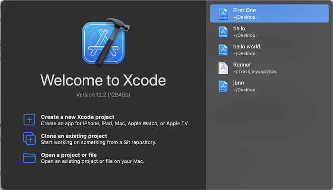
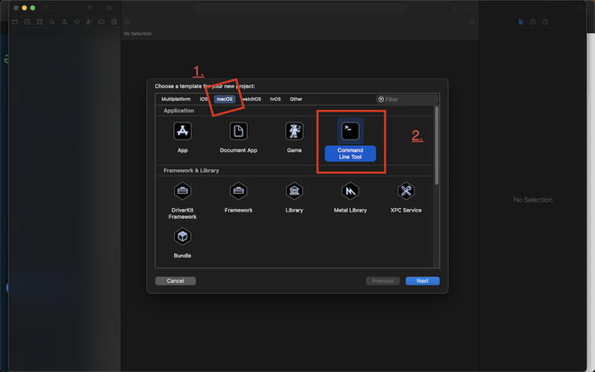
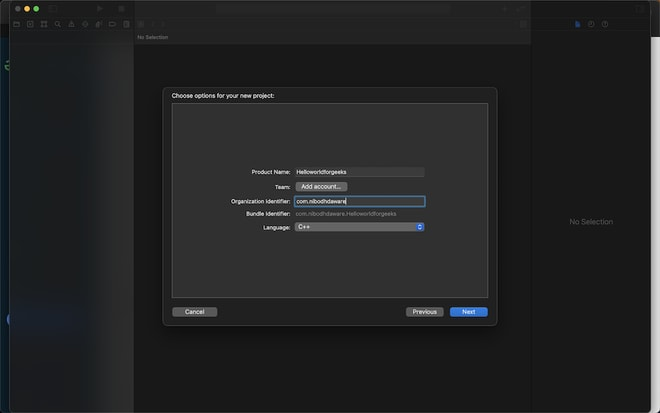
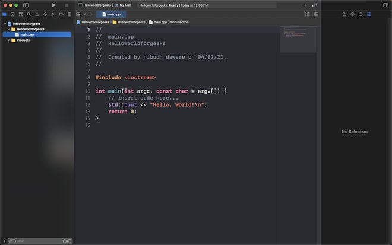
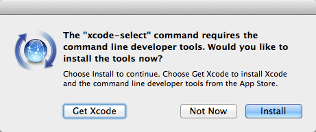
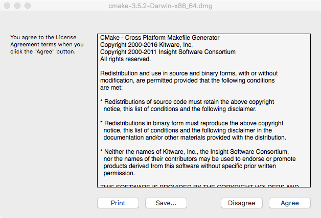
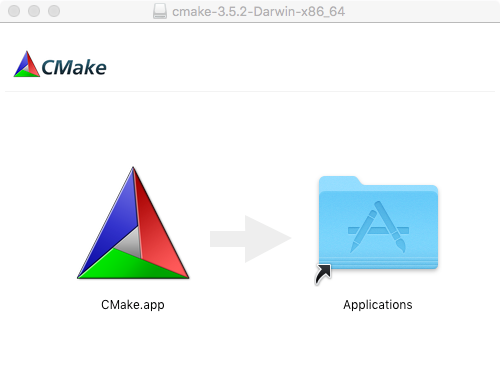

- [Setting up the development environment](#setting-up-the-development-environment)
  - [Install Xcode](#install-xcode)
  - [Install the  Xcode command line tools](#install-the--xcode-command-line-tools)
  - [Install GCC](#install-gcc)
  - [Install CMake](#install-cmake)

<a name="setting-up-the-development-environment"></a>

## Setting up the development environment

Setting up a C++ development environment on macOS can be done in many ways:

1. Install Xcode
2. Install the Xcode Command Line Tools and use any preferred IDE or Code Editor for writing C or C++ code
3. Install GCC instead of Clang (shiped with Xcode)

<a name="install-xcode"></a>

### Install Xcode

The Xcode development environment includes the Clang C/C++ compiler and various development tools. You can install it from the Mac App Store:

1. Open the Mac App Store.
2. Search for "Xcode."
3. Click the "Install" button next to Xcode.

You will need to agree to the license terms and download the necessary components.


The next step is to click on “Create a new Xcode project”.
If you have an existing project you will click on “Open a project or file” or “Clone an existing project” if the project is on source control.
Next, click on the macOS tab and then click on the Command-Line app as it is the only thing where we can develop apps in C and C++



It will now show an interface to give the app a name and the package name. After giving that name there would be a drop-down to select a language. So, instead of swift, you can select C or C++ and click Next



Then it will ask for the location of the project on your machine
Then, you can open or create a C or C++ file and start editing it



<a name="install-the--xcode-command-line-tools"></a>

### Install the  Xcode command line tools

 For command-line development, we can install the command line tools separately by running this command on the terminal

 ```
 xcode-select --install
 ```

 

<a name="install-gcc"></a>

### Install GCC

macOS comes with the Clang C/C++ compiler included with Xcode. You can check its version and ensure it's installed by running

```
clang++ --version
```

If you prefer using GCC, you can install it using Homebrew

1. Install Homebrew (if not already installed)

   ```
   /bin/bash -c "$(curl -fsSL https://raw.githubusercontent.com/Homebrew/install/HEAD/install.sh)"
   ```

2. Install GCC

   ```
   brew install gcc
   ```

<a name="install-cmake"></a>

### Install CMake

CMake is an open-source, cross-platform tool that uses compiler and platform independent configuration files to generate native build tool files specific to your compiler and platform.
CMake can be installed on Mac using brew

```
brew install cmake
```

or by downloading the binaries unpacking them manually to any location:

```
wget https://cmake.org/files/v3.4/cmake-3.4.1-Darwin-x86_64.tar.gz
tar xf cmake-3.4.1-Darwin-x86_64.tar.gz
export PATH="`pwd`/cmake-3.4.1-Darwin-x86_64/CMake.app/Contents/bin:$PATH"
```

or by downloading the DMG installer from <a href="https://cmake.org/download/" target="_blank"> Download page </a>



