This section will step by step guide to the process of setting up a C++ development environment on Windows.

- [Setting up development environment](#setting-up-development-environment)
  - [Download & Install a C++ compiler](#download--install-a-c-compiler)
    - [GCC & Clang](#gcc--clang)
      - [Download \& Install MSYS2](#download--install-msys2)
      - [Install GCC](#install-gcc)
      - [Install Clang](#install-clang)
      - [What is MSYS2 and Why?](#what-is-msys2-and-why)
    - [MSVC](#msvc)
  - [Download \& Install CMake](#download--install-cmake)
    - [What is CMake and Why?](#what-is-cmake-and-why)
  - [IDEs](#ides)
    - [Setting up Visual Studio](#setting-up-visual-studio)
      - [Full package](#full-package)
      - [Standalone IDE](#standalone-ide)
  - [Text editors](#text-editors)
    - [Setting up VSCode](#setting-up-vscode)
  - [Debugging](#debugging)
    - [Debugging in VSCode](#debugging-in-vscode)
    - [Debugging in Visual Studio](#debugging-in-visual-studio)
- [Using libraries](#using-libraries)
  - [Setting up vcpkg](#setting-up-vcpkg)
  - [Finding and Installing a library](#finding-and-installing-a-library)
  - [Using a library](#using-a-library)
- [Unit Testing](#unit-testing)
  - [Google Test](#google-test)
    - [Integration with Visual Studio](#integration-with-visual-studio)
    - [Integration with VSCode](#integration-with-vscode)
  - [Microsoft Unit Test](#microsoft-unit-test)
  - [CTest](#ctest)

## Setting up development environment

This section describes the steps to

1. [Download & Install a C++ compiler](#download--install-a-c-compiler)
2. [Download & Install CMake](#download--install-cmake)
3. [Download & Install an IDE/text editor](#ides)

### Download & Install a C++ compiler

This section will cover the installation of `GCC`, `Clang` and `MSVC`.

#### GCC & Clang

##### Download & Install MSYS2

[Download here](https://www.msys2.org/)

Just launch the installer and keep clicking "Next"

##### Install GCC

If you also want to install `clang`, skip this part and go directly to [Install Clang](#install-clang), because GCC is a dependency of Clang (on MSYS2) and will be automatically installed when you install clang.

1. Run MSYS2, type the following command:

```
pacman -Syu
```

`pacman` is the package manager used by MSYS2. `-S` means "sync". `-y` means "download fresh package databases from the server". `-u` means "upgrade installed packages".

This command will update the packages info, so you get the latest packages. It will prompt you like this, and you type `y` and hit enter.


1. Then it will prompt you ` To complete this update all MSYS2 processes including this terminal will be closed. Confirm to proceed [Y/n]`, type `y` and hit enter, and it will close the window after the update is done.
2. Relaunch MSYS2 from your start menu. Type:

```
pacman -S mingw-w64-x86_64-gcc
```

like this, type `y` and hit enter to install gcc


And then type:

```
pacman -S mingw-w64-x86_64-make
```

And type `y` to also install `make`.

And then type:

```
pacman -S mingw-w64-x86_64-gdb
```

And type `y` to also install `gdb`.

5. Now search for `environment variable` and open it
   

6. Click `Environment Variables`, find `Path` in `System variables`, double click to open the setting.
   

7. Click `New` and copy `C:\msys64\mingw64\bin` to the new entry.
   

8. Click `OK` to close all windows. Now you finished installing GCC. Open any shell such as `cmd` and type in `gcc --version` and you shall see the following: 

##### Install Clang

Installing Clang will also automatically install `GCC` (on MSYS2).

1. Run MSYS2, type the following command:

```
pacman -Syu
```

`pacman` is the package manager used by MSYS2. `-S` means "sync". `-y` means "download fresh package databases from the server". `-u` means "upgrade installed packages".

This command will update the packages info, so you get the latest packages. It will prompt you like this, and you type `y` and hit enter.


3. Then it will prompt you ` To complete this update all MSYS2 processes including this terminal will be closed. Confirm to proceed [Y/n]`, type `y` and hit enter, and it will close the window after the update is done.

4. Relaunch MSYS2 from your start menu. Type:

```
pacman -S mingw-w64-x86_64-clang mingw-w64-x86_64-clang-tools-extra
```

like this, type `y` and hit enter to install clang
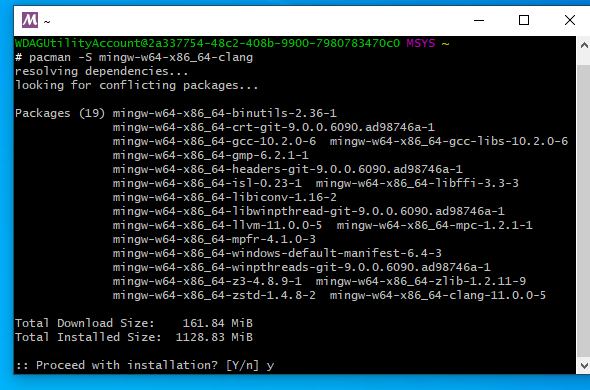

And then type:

```
pacman -S mingw-w64-x86_64-make
```

And type `y` to also install `make`.

And then type:

```
pacman -S mingw-w64-x86_64-gdb
```

And type `y` to also install `gdb`.

5. Now search for `environment variable` and open it
   

6. Click `Environment Variables`, find `Path` in `System variables`, double click to open the setting.
   

7. Click `New` and copy `C:\msys64\mingw64\bin` to the new entry.
   

8. Click `OK` to close all windows. Now you finished installing clang. Open any shell such as `cmd` and type in `clang --version` and you shall see the following: 

Note: `Clang` and `GCC` is installed to the same directory, eg. under `C:\msys64\mingw64\bin`. Don't be confused by the directory `C:\msys64\clang64`. It is an empty folder.

##### What is MSYS2 and Why?

> MSYS2 is a collection of tools and libraries providing you with an easy-to-use environment for building, installing and running native Windows software.

But basically, we use its implementation of MingW(Minimalist GNU for Windows), which is a collection of common developing tools seen on GNU/Linux operating systems.

#### MSVC

MSVC is Microsoft Visual C++ compiler. And you do NOT have to install Visual Studio in order to get MSVC. However, if you also want Visual Studio, skip to [setting up visual studio](#setting-up-visual-studio) directly.

1. Download [MSVC](https://visualstudio.microsoft.com/downloads/#build-tools-for-visual-studio-2019), select `Build Tools for Visual Studio 2019`
2. Launch the installer and select these workflows
   
3. You have finished installing MSVC. Click `Launch` and type `cl` and you should see this:
   

Do NOT try to add `MSVC` directly to system `PATH` because each compiler toolchain for different architecture has its own version.

This command prompt is specific to 64bit Windows architecture and has set some temporary environment variables. You can find it in `Start` -> `Visual Studio 2019` -> `Developer Command Prompt for VS 2019` like this: 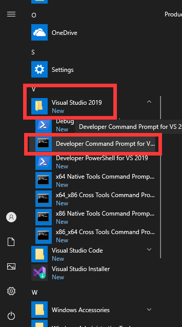

After MSVC is installed, cmake can detect it as a compiler.


### Download & Install CMake

You can either install CMake by using the official installer or using a package manager like `MSYS2`,
which you used to install `GCC` and `Clang`.

- Using the installer:

  1. [Download here](https://cmake.org/download/), choose the `Windows win64-x64 Installer` option

  2. Launch the insatller, when you see this screen, choose `Add CMake to the system PATH for all users`
     
     Now you finished installing cmake.

- Using `MSYS2`:
  1. Run `MSYS2` and type this command and type `Y` to install
  ```
  pacman -S mingw-w64-x86_64-cmake
  ```
  2. Search for `environment variable` and open it -> `Environment Variables`, find `Path` in `System variables`, double click to open the setting -> click `New` and copy `C:\msys64\usr\bin` to the new entry.
     

#### What is CMake and Why?

CMake is a cross-platform build-system generator, which generates build files (some files dictating how your source files should be built) for your platform.

For example, on Windows by default, it generate `Visual Studio Solutions` (which is some files dicating how your source files should be built, native to `Visual Studio`) if you have Visual Studio installed. On Linux by default, it generates `Unix Makefiles` (which is some files dictating how your source files should be built, native to `make`).

Note:

> It is a bug if your C/C++ project does NOT provide CMake support.

### IDEs

This section will cover setting up `Visual Studio` but there are plenty of other choices out there like `Dev-C++`, `CLion`, `QtCreator`, `Cevelop (based on Eclipse)` and `Eclipse`.

#### Setting up Visual Studio

You can install Visual Studio as a standalone IDE or as a whole package including compiler, toolchain and windows sdk.

##### Full package

1. Download [Visual studio](https://visualstudio.microsoft.com/downloads/). Choose the `Community` option.

2. Run the installer, select these workflows
   

3. After installation, you are prompt to restart your computer. And then you will need to register a Microsoft Account to continue using Visual Studio.

4. Run Visual Studio, select `Create a new project` -> `Empty Project/Console App`, and select `Place solution and project in the same directory`.
   
   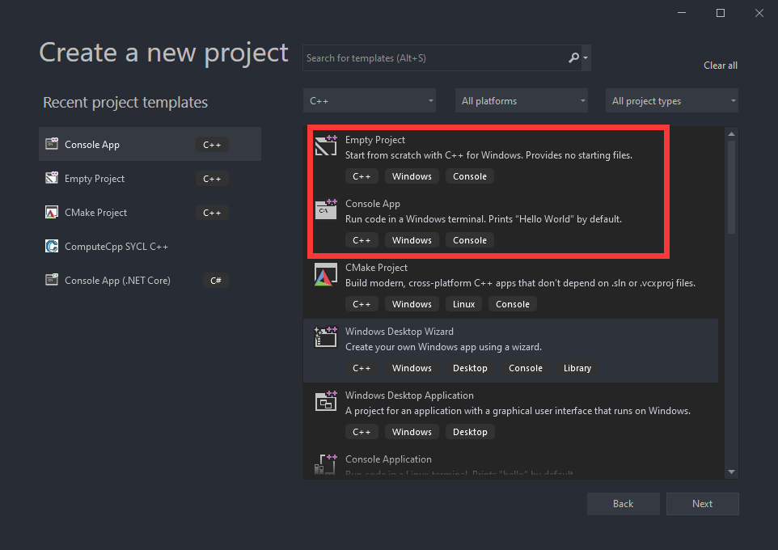
   
   The only difference between `Empty Project` and `Console App` is the latter will provide you with a "Hello world" program and that's it! All the default include directories and default linked runtime libraries are the same!

- If you choose to create `Empty Project`, right click on the `<Project Name>` -> `Add` -> `New item` -> `C++ source file` -> `Add`, like this:
  
  
  Then write a simple "Hello world" program and hit `ctrl+f5` to compile and run it, and you shall see this:
  

- If you choose to create `Console App`, you shall see the already created "Hello world". Hit `ctrl+f5` to compile and run the program and you shall see this: 

##### Standalone IDE

If you install Visual Studio as a standalone IDE without installing MSVC compiler toolchains, you can use it with CMake. If you have installed MSVC compiler toolchain, you can use it with Visual Studio solution just as it's a [full install](#full-package) like above. Here I introduce how to use it with CMake, **without MSVC**.

1. Download [Visual studio](https://visualstudio.microsoft.com/downloads/). Choose the `Community` option.

2. Run the installer, select these workflows and deselect all the optionals on the right, like this
   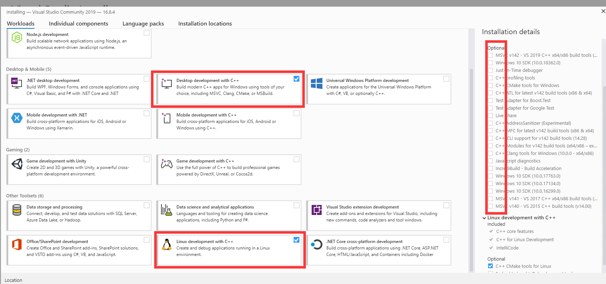

3. After installation, you need to register a Microsoft Account to continue using Visual Studio.

4. Run Visual Studio, select `Create a new project` -> `CMake Project` -> select `Place Project under the same directory` -> `Create`, like this:
   
   
   
5. Visual Studio will auto generate a "Hello world" project for you, and it can successfully configure the project and compile because CMake can detect the installed `GCC`. However, it will have incorrect include errors.
   
6. To solve this error, click on the configuration menu -> `Manage Configurations` -> click the add button -> select `Mingw64-Debug` -> click on the previous old configuration and click delete button
   
   
   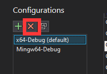
7. Hit `ctrl+s` to save this configuration, then the include error should go away.
   

Note: If for some reason, Visual Studio doesn't detect the right MingW version, you will still get include errors. You need to edit the `CMakeSettings.json` and correct the MingW version, like this:

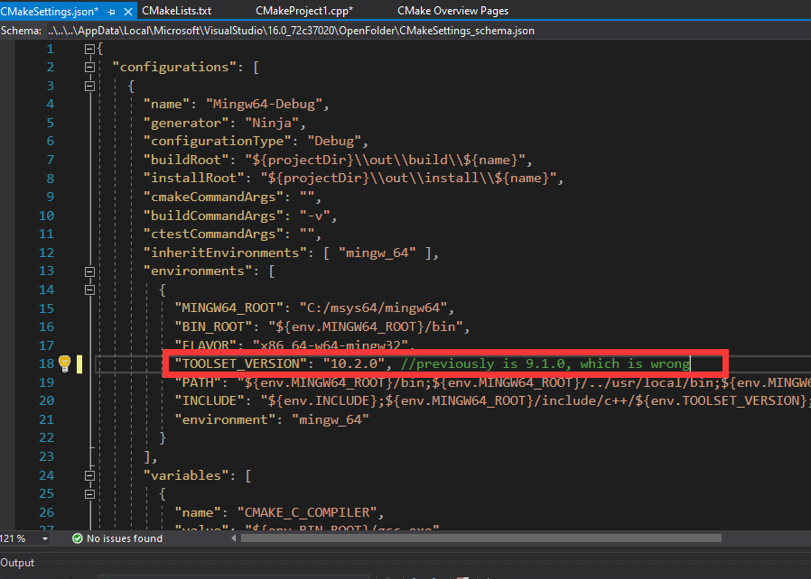

### <a name="text-editors"> </a> Text editors

#### Setting up VSCode

1. Download [vscode](https://code.visualstudio.com/)
2. Launch the installer, when you see this screen, I **strongly recommend you follow this setting**
   

3. Run vscode, in the `extension` tab, search and install the following extensions

   - Install `Microsoft C/C++` extension, It is a Language Server by Microsoft.
     
   - And 2 extensions for cmake. The first one in the list is for syntax highlighting when writing cmake scirpts.
   - The second one in the list is for actually running Cmake.
     

4. Go to settings, search `generator`. And set `Cmake:Generator` to `MinGW Makefiles`, like this:
   

5. Create a folder, open it in vscode. Use `ctrl + shift + p` to open the command menu, type `cmake` and choose `CMake: Quick Start`, like this:
   

6. The cmake tool will scan the kits and there will be 2 kits. Select the first one.
   

7. Type a name for your project, select `Executable`, CMake tool will automatically generate a helloworld project for you. And you probably don't want to enable ctest for now, so delete everything excpet the following 3 lines:
   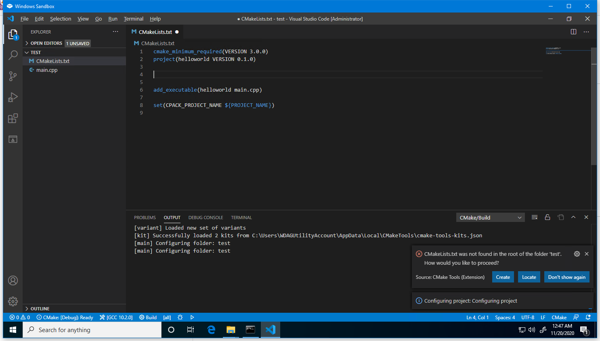
   Rememeber to click `Allow` when cmake want to configure the intellisense.

8. And now you can run it and debug it, and have everything working (syntax highlighting, auto complete, header files...).
   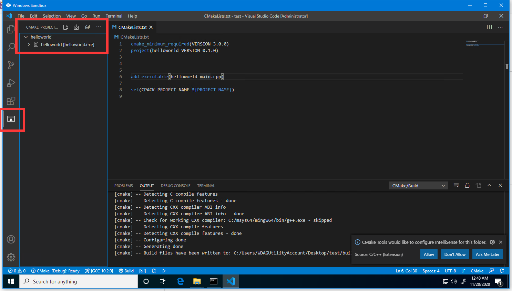
   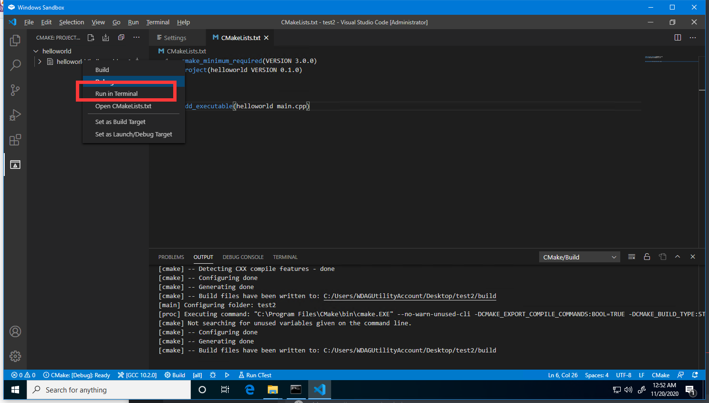
   

## Debugging

This section describes how to debug in various IDEs/text editors.

### Debugging in VSCode

To launch the debugger in VSCode, click the cmake project menu -> right click on the `<target name>` -> `Debug` like this: 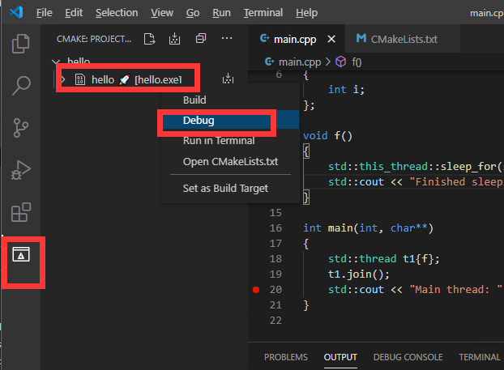

See more documentation for VSCode's debugging UI [here](https://code.visualstudio.com/docs/cpp/cpp-debug#_windows-debugging-with-gdb), except for the part that sets `launch.json` because the [CMake](#setting-up-vscode) tools already handles everything :)

### Debugging in Visual Studio

Click here 

For more, see documentation [here](https://learn.microsoft.com/en-us/visualstudio/debugger/debugger-feature-tour?view=vs-2022)

## Using libraries

### Setting up vcpkg

`vcpkg` is a C/C++ package manager, which makes using libraries much easier (almost as easy as using `pip` in python).

1. Open a shell(`cmd`) and go to the directory where you want `vcpkg` to be installed. (Something like `C:\` or `C:\dev`)
2. Type this command:
   ```
   git clone https://github.com/microsoft/vcpkg
   ```
3. Type this command:
   ```
   .\vcpkg\bootstrap-vcpkg.bat
   ```
4. Type this command:
   ```
   .\vcpkg\vcpkg.exe integrate install
   ```

### Finding and Installing a library

- To find a library, use `vcpkg search <library>`
- To install a library, use `vcpkg install <library>:x64-windows` or `vcpkg install <library>:x86-windows`

> [!NOTE] > `vcpkg` will build 32 bit libraries by default on Windows (although it's 64 bit on Linux by default), which is NOT probably what you want, so you want to speficy the architecture by adding `:x64-windows`.

### Using a library

After you install the library in `vcpkg`, you either:

- Use `Visual Studio` without **ANY ADDITIONAL CONFIGURATION**
- Use `cmake` with the instruction provided by `vcpkg` when you install the library.

Below is a complete example of using `vcpkg` to install and use the [boost](https://www.boost.org/) library.

1. Install the library in `vcpkg` with `vcpkg install <Library Name>`, like this:

   ```
   vcpkg install boost:x64-windows
   ```

   And you should see the following
   

2. Note that on Windows, `vcpkg` builds libraries using `MSVC`, so you should also use `MSVC` in order to link sucessfully. Header-only libraries like `boost` may be used with other compilers like `GCC`.

Afrer the library finishes installing, you can either:

- Use it in Visual Studio without doing any additional configuration
  
  **Note: Configure the solution achitectural target correctly according to your library. Visual Studio empty project defaults to `x86` but you may installed `x64` library.**

- Or use it in VSCode/CLion with cmake and cmake tool chain file. See the docs [here](https://github.com/microsoft/vcpkg#using-vcpkg-with-cmake)

---

## Unit Testing

[What is unit testing?](https://en.wikipedia.org/wiki/Unit_testing)

### Google Test

[google test](https://github.com/google/googletest) is a famous and widely supported by IDEs/text editors unit testing framework for C++.

You can get google test by these ways

- Using `vcpkg`: Following setting up `vcpkg`, we can easily install the library by

  ```
  vcpkg install gtest:x64-windows
  ```

  Note that if your application is targeted to 32 bit, use this command instead

  ```
  vcpkg install gtest
  ```

- Using `MSYS2`: Note that this can only be used with `GCC & Clang` compiler from `MSYS2`.
  ```
  pacman -S pacman -S mingw-w64-x86_64-gtest
  ```

After installing the library,

- If you use Visual Studio (MSBuild Project), you just need to `#include <gtest/gtest.h>` like a normal C++ source file and either:

  - Provide a `main` function at the bottom of your source file
    ```cpp
    int main(int argc, char **argv)
    {
        ::testing::InitGoogleTest(&argc, argv);
        return RUN_ALL_TESTS();
    }
    ```
    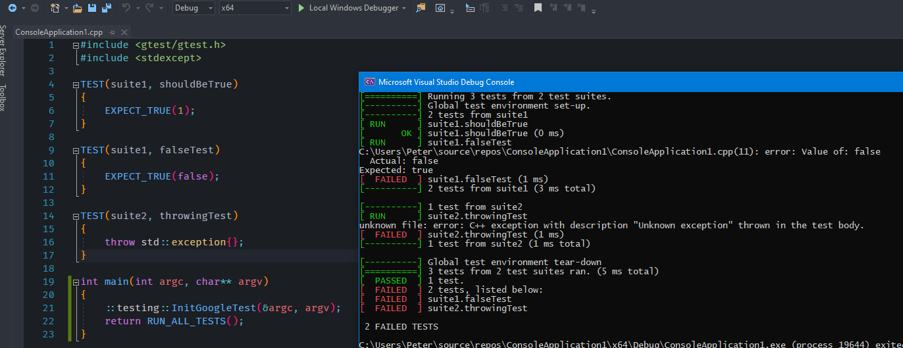
  - Don't provide a `main` function, then you need to link additional libraries in the linker settings.

    1. Right click on your project -> `Properties` -> `Linker` -> `AdditionalDependencies`,
       Make sure this configuration is `Debug` and `x64`
       (or x86 depend on the architect or your installed Gtest library)
       and add these 2 lines

    ```
    gtestd.lib
    $(VcpkgRoot)installed\$(VcpkgTriplet)\debug\lib\manual-link\gtest_maind.lib
    ```

    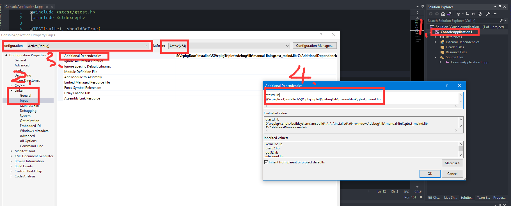

    1. Click the configuration menu to `Release` and also add these 2 lines, like this

    ```
    gtest.lib
    $(VcpkgRoot)installed\$(VcpkgTriplet)\lib\manual-link\gtest_main.lib
    ```

    

    Then you should be able to write the test source file without the `main` function, and build in both configurations like this

    - Debug build
      
    - Release build
      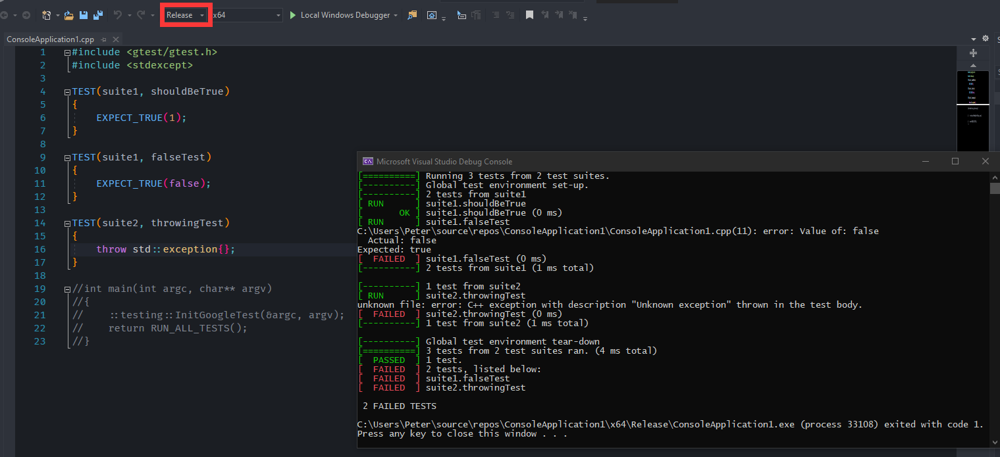

- If you use CMake, regardless of whether you installed `Google Test` library from `vcpkg` or `MSYS2`,
  you can make use of `CTest` built-in to Cmake as a test runner to run your google test,
  which is supported by most IDE/editors you will see below.
  A minimum `CMakeLists.txt` is like:

```cmake
cmake_minimum_required(VERSION 3.10.0)

project(<project name> VERSION 0.1.0)

find_package(GTest CONFIG REQUIRED)
enable_testing()
include(GoogleTest) #for gtest_discover_tests() function

add_executable(<test target name> test.cpp) #This is the testing executable
target_link_libraries(<test target name> PRIVATE GTest::gtest GTest::gtest_main) #Link it to the google test library
gtest_discover_tests(<test target name>)  #integrate google test with ctest to this testing executable
```

- Or you simply want a testing executable, so you don't bother with `CTest`.

```cmake
cmake_minimum_required(VERSION 3.10.0)

project(<project name> VERSION 0.1.0)

find_package(GTest CONFIG REQUIRED)
add_executable(<test target name> test.cpp) #This is the testing executable
target_link_libraries(<test target name> PRIVATE GTest::gtest GTest::gtest_main) #Link it to the google test library
```


#### Integration with VSCode

You need to use [`CTest`](#google-test) (the first version of the minimum `CMakeLists.txt`) as your test runner to get the integration working.

1. Install the [CMake Test Explorer](https://marketplace.visualstudio.com/items?itemName=fredericbonnet.cmake-test-adapter) extension (proud contributor)
2. Open VSCode settings, go to `Extension` -> `CMake Test Explorer` section, and change these following settings:
   - Build Config: `${buildType}`
   - Build Dir: `${buildDirectory}`
   - Select Cmake Integration
     
3. After that, build your project once and then click the `refresh test` button, this plugin should find all the testing suites and test cases in your test files.
   
4. Then you can easily manage or debug all your test cases or each individual test in this panel.
   

## Source control

Most if not all of the development workflow involves using `Git`.
Also, some of CMake's functionalities requires Git to be installed.
And you also need Git to install `vcpkg`.
You can install `Git` either by using the installer or using a package manager,
like `MSYS2` which we just used above to install `GCC` and `Clang`.

- Install by using the installer
  1. Download the installer [here](https://git-scm.com/download/win) and then it can be installed by keep clicking `Next`.
- Install by using a package manager
  - chocolatey: `choco install git`
  - scoop: `scoop install git`
  - winget: `winget install git`

---

## Addtional Tooling

### ClangFormat

[ClangFormat](https://clang.llvm.org/docs/ClangFormat.html) is a code formatting tool to help your code follow some pre-defined formatting rules.

In all IDE/editors, the actual ClangFormat executable needs to be installed first.

#### Integration with Visual Studio

1. Install [this plugin at the bottom "Visual Studio plugin installer"](https://llvm.org/builds/)
2. Then you can find settings in `Tools` -> `Options` -> `LLVM/Clang` -> `ClangFormat`
   

#### Integration with VSCode

ClangFormat is supported by VSCode C++ extension out-of-the-box.
ClangFormat settings can be found in C++ extension settings.


### C/C++ include guard (proud contributor)

is a [VSCode](#setting-up-vscode) extension that automatically add include guard for you so that you no longer need to remember it.
Download [here](https://marketplace.visualstudio.com/items?itemName=akiramiyakoda.cppincludeguard).

### include-info (proud maker)

is a [VSCode](#setting-up-vscode) extension that shows the included header file size
and provide a fast way to jump to those included files.
Download [here](https://marketplace.visualstudio.com/items?itemName=HO-COOH.include-info)
